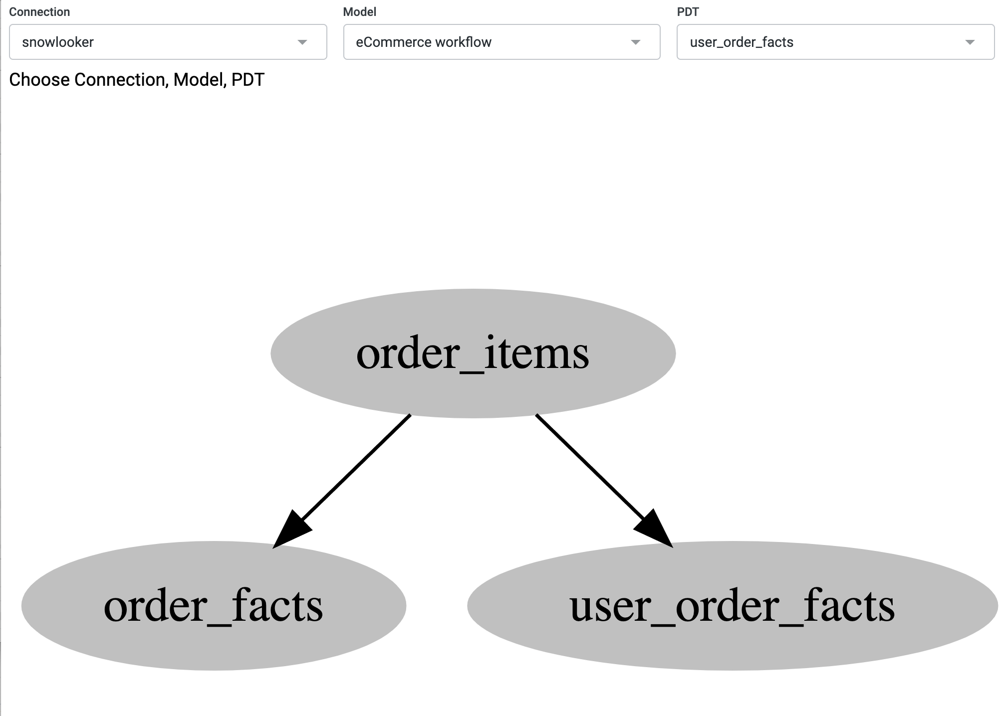

# Looker Extension pdt_graph

pdt_graph is a Looker extension Sample Application to show PDT Dependency Graph using React and JavaScript.


## Getting Started for Development

1. Install the dependencies with [Yarn](https://yarnpkg.com/).

    ```sh
    yarn install
    ```

2. Build the project

    ```sh
    yarn build
    ```

3. Start the development server

    ```sh
    yarn develop
    ```

    The development server is now running and serving the JavaScript at http://localhost:8080/bundle.js.

4. Now log in to Looker and create a new project.

    Depending on the version of Looker, a new project can be created under:

    - **Develop** => **Manage LookML Projects** => **New LookML Project**, or
    - **Develop** => **Projects** => **New LookML Project**

    Select "Blank Project" as the "Starting Point". This creates a new LookML project with no files.

5. Create a `manifest` file

   Either drag and upload the `manifest.lkml` file in this directory into your Looker project, or create a `manifest.lkml` with the same content. Change the `id`, `label`, or `url` as needed.

   ```
    project_name: "pdt_graph"
    application: pdt_graph {
    label: "pdt_graph"
    url: "http://localhost:8080/bundle.js"
    entitlements: {
        core_api_methods: ["all_lookml_models","run_inline_query","all_connections","graph_derived_tables_for_view"] #Add more entitlements here as you develop new functionality
    }
   ```

6. Create a `model` LookML file in your project.

   Typically, the model is named the same as the extension project. The model is used to control access to the extension.

   - [Configure the model you created](https://docs.looker.com/data-modeling/getting-started/create-projects#configuring_a_model) so that it has access to some connection (any connection).

7. Connect the new project to Git.

   - Create a new repository on GitHub or a similar service, and follow the instructions to [connect your project to Git](https://docs.looker.com/data-modeling/getting-started/setting-up-git-connection)

8. Commit the changes and deploy them to production through the Project UI.

9. Reload the page and click the `Browse` dropdown menu. You should see the extension label in the list.

   - The extension will load the JavaScript from the `url` you provided in the `application` definition. By default, this is `http://localhost:8080/bundle.js`. If you change the port your server runs on in the `package.json`, you will need to also update it in the `manifest.lkml`.
   - Reloading the extension page will bring in any new code changes from the extension template.

## Deploying the extension

To allow other people to use the extension, build the JavaScript bundle file and directly include it in the project.

1. Build the extension with `yarn build` in the extension project directory on your development machine.
2. Drag and drop the generated `dist/bundle.js` file into the Looker project interface
3. Modify your `manifest.lkml` to use `file` instead of `url`:

   ```
    project_name: "pdt_graph"
    application: pdt_graph {
        label: "A Looker React/JavaScript extension"
        file: "bundle.js"
        entitlements: {
          core_api_methods: ["all_lookml_models","run_inline_query","all_connections","graph_derived_tables_for_view"] #Add more entitlements here as you develop new functionality
        }
    }
   ```
